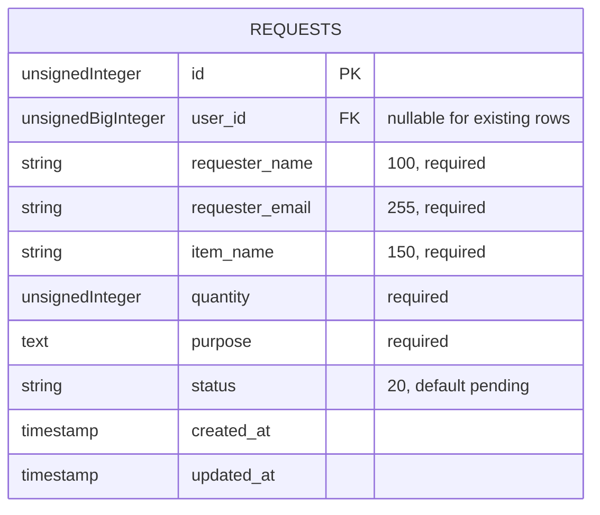

# Daymark To-Do List System

A responsive Laravel-based task management system for creating, organizing, searching, completing, editing, and deleting personal tasks. Daymark includes task due dates, priority levels, task filters, a responsive workspace layout, and a mobile-friendly navigation dock.

## Project Information

- **Developer:** JOHN LOYD SERAPION
- **Section:** BSIT 4-3
- **Framework:** Laravel 12
- **Database:** MySQL
- **GitHub Repository:** https://github.com/KaiiGritt/to-do-list.git

## Features

- Create new tasks with notes, due dates, and priority levels
- Mark tasks as complete or reopen them
- Edit and delete tasks
- Search tasks by title or notes
- Filter tasks by My Tasks, Today, Upcoming, and Completed
- Responsive desktop and mobile interface
- Database-backed task storage through Laravel migrations

## Software Requirements

Install the following software before setting up the project:

- PHP 8.2 or higher
- Composer 2.x
- Node.js 20 or higher and npm
- MySQL 8.0 or higher, or MariaDB 10.4 or higher
- Git
- A web browser

Verify the installations:

```bash
php --version
composer --version
node --version
npm --version
mysql --version
```

## Laravel Installation Instructions

1. Clone the repository:

```bash
git clone https://github.com/KaiiGritt/to-do-list.git
cd to-do-list
```

2. Install PHP dependencies:

```bash
composer install
```

3. Create the environment file:

```bash
copy .env.example .env
```

For macOS or Linux, use:

```bash
cp .env.example .env
```

4. Generate the Laravel application key:

```bash
php artisan key:generate
```

5. Install frontend dependencies:

```bash
npm install
```

## Database Configuration

The current local `.env` uses the existing MySQL database `to_do_list_db`. Keep that database name when continuing the Laboratory 1 setup. For a fresh local installation, create the database first and set `DB_DATABASE` to its name in `.env`.

```text
to_do_list_db
```

Confirm the non-secret connection settings in `.env`:

```env
DB_CONNECTION=mysql
DB_HOST=127.0.0.1
DB_PORT=3306
DB_DATABASE=to_do_list_db
```

Keep your local username and password in `.env`; never commit or publish that file or its credentials.

## Database Import Instructions

### Recommended: Import Using Laravel Migrations

This project includes migrations for the application tables, including the tasks and requests tables. After configuring `.env`, run:

```bash
php artisan migrate
```

To reset and recreate all database tables during development:

```bash
php artisan migrate:fresh
```

**Do not run `migrate:fresh` against the Laboratory 1 or Laboratory 2 database.** It drops application tables and their records. Use the additive migrations below with `php artisan migrate --seed` to keep existing records.

To migrate and seed the database, if seed data is available:

```bash
php artisan migrate --seed
```

### Optional: Import an SQL Dump

If you have an SQL backup file such as `database.sql`, create the database first and import it with:

```bash
mysql -u root -p to_do_list_system < database.sql
```

On Windows PowerShell, you can use:

```powershell
Get-Content .\database.sql | mysql -u root -p to_do_list_system
```

This repository uses Laravel migrations as the primary database setup method. No separate SQL dump is required for a fresh installation.

## Laboratory 2: Requests Data Model

The `requests` table stores request details, their current state, and Laravel creation/update timestamps. The local database used for verification is `to_do_list_db`. A later preparation migration adds a nullable `user_id` foreign key so older Laboratory 2 rows remain unchanged and can remain unassigned.

### User stories and acceptance criteria

**Requester:** As a requester, I want to submit my contact details, requested item, quantity, and purpose so that the request is recorded for review.

- A saved request contains a requester name of at most 100 characters, email of at most 255 characters, item name of at most 150 characters, quantity, and a purpose.
- A new request without an explicitly supplied status is stored as `pending`.

**Staff reviewer:** As a staff reviewer, I want each request's details and current status stored together so that I can identify what needs review.

- Each stored request exposes its requester name, email, item name, quantity, purpose, and status.
- The status field stores up to 20 characters and defaults to `pending` for new requests.

**Record keeper:** As a record keeper, I want each request to have a unique identifier and timestamps so that I can distinguish records and track when they changed.

- Every saved request receives a unique primary-key ID.
- `created_at` and `updated_at` are populated when a request is created; `updated_at` changes when the record is updated.

### Table diagram



### Data dictionary

| Field | Data type | Constraints | Purpose |
| --- | --- | --- | --- |
| `id` | unsigned big integer | Primary key; auto-increment; unique | Unique request number. |
| `user_id` | unsigned big integer | Nullable foreign key to `users.id`; set null when the user is deleted | Student who owns the request; null for pre-existing unassigned rows. |
| `requester_name` | string, 100 characters | Required | Person submitting the request. |
| `requester_email` | string, 255 characters | Required | Requester's contact address. |
| `item_name` | string, 150 characters | Required | Requested item or service. |
| `quantity` | unsigned integer | Required; application rule must require a value greater than zero | Number of items or units requested. |
| `purpose` | text | Required | Reason for the request. |
| `status` | string, 20 characters | Required; defaults to `pending` | Current request state. |
| `created_at` | timestamp | Nullable Laravel timestamp | When the request was created. |
| `updated_at` | timestamp | Nullable Laravel timestamp | When the request was last updated. |

An unsigned integer disallows negative quantities but still permits zero, so the later application validation must require quantity to be greater than zero. New requests begin as `pending` because they have not yet been reviewed; the database default also supplies this state when an insert omits `status`.

### Migration and verification

The migration is `database/migrations/2026_09_30_000000_create_requests_table.php`. It creates the table in `up()` and drops it in `down()` so the migration can be rolled back. Existing records must not be deleted to resolve a table-name conflict; check the active database and table before applying it.

Run and verify the migration:

```bash
php artisan migrate
php artisan migrate:status
```

In phpMyAdmin or another MySQL client, select `to_do_list_db`, inspect the `requests` structure, and verify the columns and types above. To display the sample records:

```sql
SELECT id, requester_name, item_name, quantity, status FROM requests;
```

For the default-status check, insert at least one sample request without specifying `status`, then verify that its stored status is `pending`. All sample quantities must be positive.

The `.env` file contains local database credentials, is excluded by `.gitignore`, and must not be included in GitHub screenshots or submissions.

## Starting Checkpoint: Login and Student Request Ownership

Create the existing database if necessary, configure the ignored local `.env`, then run the additive setup and trusted seed:

```bash
php artisan migrate --seed
```

Do not use `migrate:fresh` on the Laboratory 1/2 database. Confirm the active database and pending migrations first with `php artisan migrate:status`.

This creates or updates two student accounts and one administrator account through the trusted `DatabaseSeeder`; no public registration or user-controlled role assignment is provided. The `ServiceRequest` Eloquent model maps to the existing `requests` table, and each sample request is associated with its student through `user_id`. The seeder is safe to rerun and does not truncate or delete existing Laboratory 2 request rows. Existing requests retain their fields and receive a null `user_id` until deliberately assigned.

| Account label | Email | Role |
| --- | --- | --- |
| Avery Student (Student A) | `avery.student@example.test` | Student |
| Jordan Student (Student B) | `jordan.student@example.test` | Student |
| Morgan Administrator | `morgan.admin@example.test` | Administrator |

These are fictional classroom accounts; use the trusted local seeder to initialize their passwords, and never publish credentials. Sign in at `/login`. The preparation migration can be rolled back with `php artisan migrate:rollback --step=1`; its `down()` removes only the added `requests.user_id` and `users.role` columns, not the requests table or the original Laboratory 2 columns.

### Environment verification record

- Laravel Framework: **12.69.2** (`php artisan --version`).
- Configured existing MySQL database name: **`to_do_list_db`**. The local MySQL server refused the connection during verification, so `php artisan migrate:status` could not read migration status or production request IDs.
- The isolated, freshly migrated SQLite HTTP-test fixture had request ID **1** owned by Student A (`user_id` 1) and request ID **2** owned by Student B (`user_id` 2); both remained `pending` after denied valid-CSRF status updates. These are test-fixture IDs, **not** claimed as IDs from MySQL.

## Secure Request Ownership and Status Access

The access policy for service requests is implemented in `app/Policies/ServiceRequestPolicy.php` and tracked by GitHub issue [#2: Secure request ownership and status access](https://github.com/KaiiGritt/to-do-list/issues/2).

- Students may list and view only requests whose `user_id` matches their authenticated account, and may submit requests only for themselves. Submitted identity and initial `pending` status come from trusted server-side data; client-supplied `user_id`, requester identity, or status is ignored.
- Administrators may list and view all requests, including unassigned legacy requests, and may change a request status to `pending`, `approved`, or `rejected`.
- Students and other non-administrator roles cannot change status. Guests cannot access request routes. Unauthorized direct access is denied even when a record ID is known.
- A student submission containing `user_id`, `requester_name`, `requester_email`, `status`, `is_admin`, or `role` is rejected with validation errors; ownership and requester identity are assigned server-side.
- A purpose is limited to 2,000 characters, quantity must be an integer of at least one, and item name must be a non-empty string of at most 150 characters.

### Request routes

| Method | Path | Access | Behavior |
| --- | --- | --- | --- |
| `GET` | `/requests` | Authenticated; student list is scoped by `user_id`; administrator list is global | List requests. |
| `GET` | `/requests/{serviceRequest}` | Owner or administrator | View one request; another student's request returns **403**. |
| `POST` | `/requests` | Authenticated student | Validate and create with server-assigned owner, requester details, and `pending` status. |
| `PATCH` | `/requests/{serviceRequest}/status` | Administrator only | Update only an allowlisted status. |

Web CSRF protection remains enabled. Blade renders stored user text with escaped `{{ }}` output. Authentication and authorization are distinct: every protected route requires `auth`, while the policy checks the operation and record owner.

### Pair responsibilities and maintainers

| Area / duty | Maintainer | Responsibility |
| --- | --- | --- |
| Access policy | KaiiGritt (driver); Celena0402 (reviewer) | Maintain role and ownership authorization rules in `app/Policies/ServiceRequestPolicy.php`. |
| Controller | KaiiGritt (driver); Celena0402 (reviewer) | Maintain request scoping, validation, and server-assigned ownership in `app/Http/Controllers/ServiceRequestController.php`. |
| Routes | KaiiGritt (driver); Celena0402 (reviewer) | Maintain authenticated request endpoints in `routes/web.php`. |
| Views | KaiiGritt (driver); Celena0402 (reviewer) | Maintain student request and administrator review screens in `resources/views/service-requests/`. |
| Tests | Celena0402 (reviewer/test owner); KaiiGritt (driver) | Maintain measurable authorization and request-integrity checks in `tests/Feature/ServiceRequestAccessTest.php`. |

Session duty exchange: KaiiGritt starts with the keyboard and implements; Celena0402 reviews the changes and runs the acceptance tests using their own GitHub account. For the second pass, exchange keyboard and testing duties: Celena0402 drives a follow-up verification/change while KaiiGritt performs the reviewer/testing pass. `.github/CODEOWNERS` records both maintainers. Repository access was checked: Celena0402 is a repository collaborator.

The GitHub `main` branch has protection enabled: changes must arrive by pull request, at least one approval is required, stale approvals are dismissed after new commits, code-owner review is required, conversations must be resolved, and protection cannot be bypassed. Therefore, record Celena0402's independent approval on the pull request before merging; the branch rule also blocks merging without an approval.

### Acceptance checks

The access matrix was run against the local isolated SQLite test database. Automated feature cases are in `tests/Feature/ServiceRequestAccessTest.php`; the live CSRF and authenticated-valid-token checks use a disposable migrated SQLite fixture, not the unavailable existing MySQL database.

| Case | Expected | Actual | Result / evidence |
| --- | --- | --- | --- |
| T01 guest list and detail | Redirect to login; disclose no request data | Both GETs redirected to login without request content | **PASS** — `ServiceRequestAccessTest`, T01 |
| T02 each student list and owned detail | Each sees and opens own records only | Both lists scoped; each owner's detail returned 200 | **PASS** — `ServiceRequestAccessTest`, T02 |
| T03 cross-student direct record ID | Denied consistently with 403; disclose no details | Both cross-owner GETs returned 403 with no requester email | **PASS** — `ServiceRequestAccessTest`, T03 |
| T04 student status PATCH with valid session and CSRF | Denied; original status unchanged | Both students' authenticated requests with valid CSRF tokens returned 403; IDs 1 and 2 remained `pending` | **PASS** — live HTTP check and isolated SQLite record query; test case T04 also verifies write denial |
| T05 administrator access | List/view all; valid status update persists | Admin saw both requests, opened details, and set each allowed status | **PASS** — `ServiceRequestAccessTest`, T05 |
| T06 invalid creation values | Reject zero/negative/non-integer quantity, blank item, or purpose >2,000; save no invalid row | All inputs returned 422; request count unchanged | **PASS** — `ServiceRequestAccessTest`, T06 |
| T07 client-supplied privileged fields | Reject `user_id`, requester identity, `status`, `is_admin`, and `role` | Every forged field returned 422; no row created and seeded roles/statuses unchanged | **PASS** — `ServiceRequestAccessTest`, T07 |
| T08 markup and apostrophe | Escape markup on output; store apostrophe safely | Markup rendered as text and apostrophe round-tripped unchanged | **PASS** — `ServiceRequestAccessTest`, T08 |
| T09 missing/invalid CSRF | Live web write rejected, normally 419; data unchanged | Live HTTP POST without token returned 419; fixture still contained only its two seeded rows | **PASS** — live HTTP check and isolated SQLite record query (feature test runner bypasses CSRF middleware) |
| T10 administrator invalid status | Reject status outside allowlist with 422; preserve prior value | JSON PATCH returned 422; status remained `pending` | **PASS** — `ServiceRequestAccessTest`, T10 |

Run the suite with `php artisan test`; run a production asset build with `npm run build`. Re-run both before pushing changes.

### Dependency audit record

- `composer audit --no-interaction`: **PASS**, no security vulnerability advisories found.
- `npm audit --json`: **FAIL**, 3 development dependency findings (2 critical and 1 high). The critical `shell-quote` command-injection advisory is [GHSA-pqg4-j6r4-53mv](https://github.com/advisories/GHSA-pqg4-j6r4-53mv), affecting installed `shell-quote` 1.9.0 and the `concurrently` development-tool path. The high `source-map-js` denial-of-service advisory is [GHSA-68fv-2mgg-jv7q](https://github.com/advisories/GHSA-68fv-2mgg-jv7q), affecting installed 1.2.1.
- `npm audit --omit=dev --json`: **PASS**, no production dependency advisories reported.
- No automatic dependency upgrades were applied and no lockfiles were changed. Follow up by reviewing the proposed compatible development-tool updates, applying them on a separate change, then rerunning both npm audit modes and the frontend build.
- `.env` is ignored by Git and is not tracked. `.env.example` contains placeholders/defaults only; never commit real credentials. In shared/deployed environments use `APP_DEBUG=false`. If any real secret is exposed, revoke or rotate it first, then remove it from tracked content and address repository history; deleting the file alone is insufficient.

### Pull request and conflict-resolution gate

Open a pull request from `feature/lab3-secure-requests` to `main`, link issue #2, and obtain a recorded approval from Celena0402 after the final push. The protected `main` branch requires an approved pull request and code-owner review; the author must not approve their own changes.

No instructor-prepared divergent README change was present on `origin/main` when this work was checked. Do not manufacture a conflict or claim one was resolved. Before the conflict-resolution checkpoint, obtain the instructor's prepared conflicting branch, fetch/merge it into the feature branch, capture its actual conflict markers, preserve both intended instructions, resolve, test, and push. If no prepared branch is supplied, record that blocker and request it from the instructor.

## Commands Needed to Run the Project

### Start the Laravel development server

```bash
php artisan serve
```

Open the application at:

```text
http://127.0.0.1:8000
```

### Compile frontend assets

For a production build:

```bash
npm run build
```

For frontend development with automatic rebuilding:

```bash
npm run dev
```

### Run Laravel and frontend development services together

```bash
composer run dev
```

### Run tests

```bash
php artisan test
```

Or use the configured Composer script:

```bash
composer run test
```

### Clear application caches

```bash
php artisan optimize:clear
```

## Quick Setup

After cloning the repository, the following commands provide the usual setup flow:

```bash
composer install
copy .env.example .env
php artisan key:generate
npm install
php artisan migrate
npm run build
php artisan serve
```

For macOS or Linux, replace `copy .env.example .env` with `cp .env.example .env`.

## Repository

[View the project on GitHub](https://github.com/KaiiGritt/to-do-list.git)
