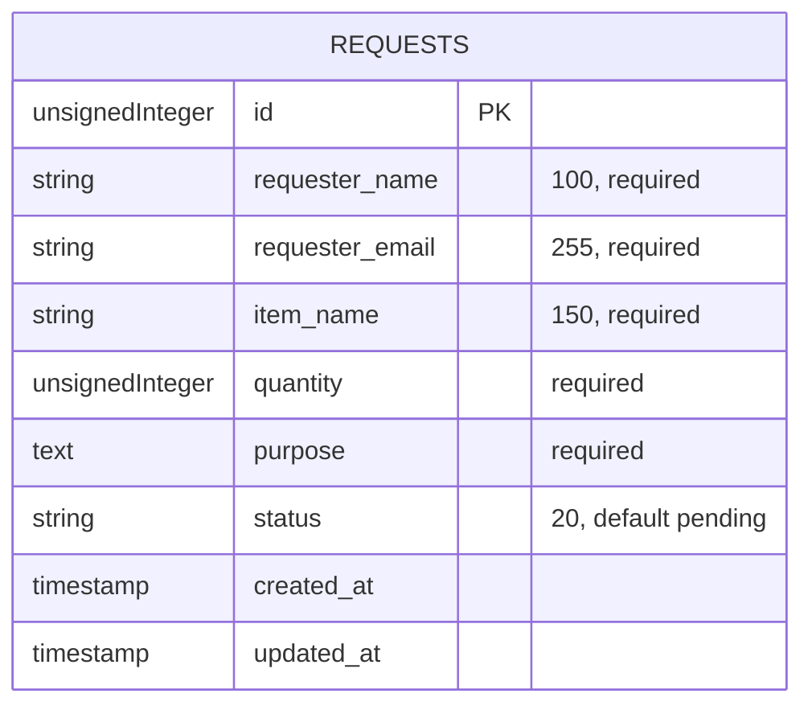

# Daymark To-Do List System

A responsive Laravel-based task management system for creating, organizing, searching, completing, editing, and deleting personal tasks. Daymark includes task due dates, priority levels, task filters, a responsive workspace layout, and a mobile-friendly navigation dock.

## Project Information

- **Developer:** JOHN LOYD SERAPION
- **Section:** BSIT 4-3
- **Framework:** Laravel 12
- **Database:** MySQL
- **GitHub Repository:** https://github.com/KaiiGritt/to-do-list.git

## Features

- Create new tasks with notes, due dates, and priority levels
- Mark tasks as complete or reopen them
- Edit and delete tasks
- Search tasks by title or notes
- Filter tasks by My Tasks, Today, Upcoming, and Completed
- Responsive desktop and mobile interface
- Database-backed task storage through Laravel migrations

## Software Requirements

Install the following software before setting up the project:

- PHP 8.2 or higher
- Composer 2.x
- Node.js 20 or higher and npm
- MySQL 8.0 or higher, or MariaDB 10.4 or higher
- Git
- A web browser

Verify the installations:

```bash
php --version
composer --version
node --version
npm --version
mysql --version
```

## Laravel Installation Instructions

1. Clone the repository:

```bash
git clone https://github.com/KaiiGritt/to-do-list.git
cd to-do-list
```

2. Install PHP dependencies:

```bash
composer install
```

3. Create the environment file:

```bash
copy .env.example .env
```

For macOS or Linux, use:

```bash
cp .env.example .env
```

4. Generate the Laravel application key:

```bash
php artisan key:generate
```

5. Install frontend dependencies:

```bash
npm install
```

## Database Configuration

The current local `.env` uses the existing MySQL database `to_do_list_db`. Keep that database name when continuing the Laboratory 1 setup. For a fresh local installation, create the database first and set `DB_DATABASE` to its name in `.env`.

```text
to_do_list_db
```

Confirm the non-secret connection settings in `.env`:

```env
DB_CONNECTION=mysql
DB_HOST=127.0.0.1
DB_PORT=3306
DB_DATABASE=to_do_list_db
```

Keep your local username and password in `.env`; never commit or publish that file or its credentials.

## Database Import Instructions

### Recommended: Import Using Laravel Migrations

This project includes migrations for the application tables, including the tasks and requests tables. After configuring `.env`, run:

```bash
php artisan migrate
```

To reset and recreate all database tables during development:

```bash
php artisan migrate:fresh
```

To migrate and seed the database, if seed data is available:

```bash
php artisan migrate --seed
```

### Optional: Import an SQL Dump

If you have an SQL backup file such as `database.sql`, create the database first and import it with:

```bash
mysql -u root -p to_do_list_system < database.sql
```

On Windows PowerShell, you can use:

```powershell
Get-Content .\database.sql | mysql -u root -p to_do_list_system
```

This repository uses Laravel migrations as the primary database setup method. No separate SQL dump is required for a fresh installation.

## Laboratory 2: Requests Data Model

The `requests` table stores request details, their current state, and Laravel creation/update timestamps. The local database used for verification is `to_do_list_db`.

### User stories and acceptance criteria

**Requester:** As a requester, I want to submit my contact details, requested item, quantity, and purpose so that the request is recorded for review.

- A saved request contains a requester name of at most 100 characters, email of at most 255 characters, item name of at most 150 characters, quantity, and a purpose.
- A new request without an explicitly supplied status is stored as `pending`.

**Staff reviewer:** As a staff reviewer, I want each request's details and current status stored together so that I can identify what needs review.

- Each stored request exposes its requester name, email, item name, quantity, purpose, and status.
- The status field stores up to 20 characters and defaults to `pending` for new requests.

**Record keeper:** As a record keeper, I want each request to have a unique identifier and timestamps so that I can distinguish records and track when they changed.

- Every saved request receives a unique primary-key ID.
- `created_at` and `updated_at` are populated when a request is created; `updated_at` changes when the record is updated.

### Table diagram



### Data dictionary

| Field | Data type | Constraints | Purpose |
| --- | --- | --- | --- |
| `id` | unsigned big integer | Primary key; auto-increment; unique | Unique request number. |
| `requester_name` | string, 100 characters | Required | Person submitting the request. |
| `requester_email` | string, 255 characters | Required | Requester's contact address. |
| `item_name` | string, 150 characters | Required | Requested item or service. |
| `quantity` | unsigned integer | Required; application rule must require a value greater than zero | Number of items or units requested. |
| `purpose` | text | Required | Reason for the request. |
| `status` | string, 20 characters | Required; defaults to `pending` | Current request state. |
| `created_at` | timestamp | Nullable Laravel timestamp | When the request was created. |
| `updated_at` | timestamp | Nullable Laravel timestamp | When the request was last updated. |

An unsigned integer disallows negative quantities but still permits zero, so the later application validation must require quantity to be greater than zero. New requests begin as `pending` because they have not yet been reviewed; the database default also supplies this state when an insert omits `status`.

### Migration and verification

The migration is `database/migrations/2026_09_30_000000_create_requests_table.php`. It creates the table in `up()` and drops it in `down()` so the migration can be rolled back. Existing records must not be deleted to resolve a table-name conflict; check the active database and table before applying it.

Run and verify the migration:

```bash
php artisan migrate
php artisan migrate:status
```

In phpMyAdmin or another MySQL client, select `to_do_list_db`, inspect the `requests` structure, and verify the columns and types above. To display the sample records:

```sql
SELECT id, requester_name, item_name, quantity, status FROM requests;
```

For the default-status check, insert at least one sample request without specifying `status`, then verify that its stored status is `pending`. All sample quantities must be positive.

The `.env` file contains local database credentials, is excluded by `.gitignore`, and must not be included in GitHub screenshots or submissions.

## Commands Needed to Run the Project

### Start the Laravel development server

```bash
php artisan serve
```

Open the application at:

```text
http://127.0.0.1:8000
```

### Compile frontend assets

For a production build:

```bash
npm run build
```

For frontend development with automatic rebuilding:

```bash
npm run dev
```

### Run Laravel and frontend development services together

```bash
composer run dev
```

### Run tests

```bash
php artisan test
```

Or use the configured Composer script:

```bash
composer run test
```

### Clear application caches

```bash
php artisan optimize:clear
```

## Quick Setup

After cloning the repository, the following commands provide the usual setup flow:

```bash
composer install
copy .env.example .env
php artisan key:generate
npm install
php artisan migrate
npm run build
php artisan serve
```

For macOS or Linux, replace `copy .env.example .env` with `cp .env.example .env`.

## Repository

[View the project on GitHub](https://github.com/KaiiGritt/to-do-list.git)

## Laboratory 3 Verification

Verification instruction: Test administrator access and administrator-only status updates.
